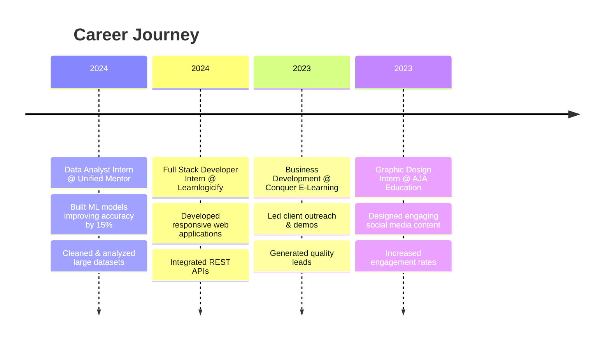

<div align="center">

<!-- Animated Header -->


<!-- Typing SVG -->
<a href="https://git.io/typing-svg"></a>

<br/>

<!-- Social Badges with Animation -->
<p>
  <a href="mailto:shashank5017sh@gmail.com">
    
  </a>
  <a href="https://github.com/shanks5017">
    
  </a>
  <a href="https://www.linkedin.com/in/shashank-tareehal">
    
  </a>
  <a href="https://shanksportfolio.vercel.app">
    
  </a>
</p>

<!-- Profile Views Counter -->


</div>

<br/>

<!-- About Section with Gradient Box -->
<div align="center">
  
## 🌟 About Me

</div>

```yaml
name: Shashank M Tareehal
located_in: Coimbatore, India
education: Computer Science & Engineering @ KIT-Coimbatore (2023-2027)
current_focus: ["AI Automation", "LLM Integration", "Full-Stack Development"]
interests: ["Generative AI", "Prompt Engineering", "Intelligent Systems"]
philosophy: "Building bridges between AI capabilities and real-world solutions"
```


### 🎯 What I Do

- 🤖 **AI & Automation**: Crafting intelligent workflows with LangChain, n8n, and custom LLM integrations
- 💻 **Full-Stack Development**: Building scalable web applications with MERN stack and modern frameworks
- 📊 **Data Analytics**: Transforming raw data into actionable insights using Python, Power BI, and ML models
- 🧠 **AI Research**: Exploring prompt engineering, RAG systems, and multi-agent architectures
- ⚡ **Problem Solver**: Converting complex challenges into elegant, automated solutions

<br/>

<div align="center">

## 🛠️ Technology Arsenal

</div>

<details open>
<summary><b>💻 Programming & Development</b></summary>
<br/>


</details>

<details open>
<summary><b>🧠 AI & Machine Learning Ecosystem</b></summary>
<br/>

**🔮 LLM Platforms & APIs**


**🔧 AI Tools & Frameworks**


**🖥️ Local LLMs & Deployment**


**📚 ML Libraries**


</details>

<details open>
<summary><b>📊 Data Analytics & Visualization</b></summary>
<br/>


</details>

<details>
<summary><b>🔧 Tools & Platforms</b></summary>
<br/>


</details>

<br/>


<div align="center">

## 🚀 Featured Projects

</div>

<table>
<tr>
<td width="50%">

### 🎨 [Shanks Portfolio](https://shanksportfolio.vercel.app)
**Personal Developer Portfolio**
- Modern, responsive design
- Interactive UI elements
- Project showcase platform


</td>
<td width="50%">

### 🛒 [ShanksMerch](https://shanks5017.github.io/shanksmerch/)
**E-commerce Merchandise Store**
- Full shopping experience
- Product catalog management
- Responsive design


</td>
</tr>

<tr>
<td width="50%">

### 🧠 [Image Classification (DNN)](https://github.com/shanks5017/Image-Corruption-Classification-using-Deep-Neural-Networks)
**Deep Learning Image Classifier**
- Classifies corrupted images
- Custom neural network architecture
- High accuracy model


</td>
<td width="50%">

### 📊 [E-Commerce Furniture Dashboard](https://github.com/shanks5017/E-commerce-Furniture.git)
**Business Analytics Platform**
- Sales insights & trends
- Interactive visualizations
- Data-driven recommendations


</td>
</tr>

<tr>
<td width="50%">

### 💻 [Laptop Price Analysis](https://github.com/shanks5017/Laptop-Price-Analysis.git)
**ML Price Prediction Model**
- 92% accuracy regression model
- Feature engineering
- Market trend analysis


</td>
<td width="50%">

### 📈 [Customer Satisfaction Prediction](https://github.com/shanks5017/Customer-Satisfaction-Prediction.git)
**ML Satisfaction Model**
- 15% improvement in predictions
- Customer behavior analysis
- Actionable insights


</td>
</tr>
</table>

<details>
<summary><b>🔍 More Projects</b></summary>
<br/>

| Project | Description | Technologies |
|---------|-------------|--------------|
| 📱 [Top Instagram Influencers](https://github.com/shanks5017/Top-Instagram-Influencers.git) | AI & NLP sentiment analysis on social media influencers | Python, NLP, APIs |
| ⚙️ [Foundry](https://github.com/shanks5017/foundry.git) | Data pipeline & automation scripts for analytics | Python, SQL, ETL |
| ✈️ [Aerodynamics](https://github.com/shanks5017/aerodynamics.git) | Simulation models for airflow & lift analysis | Python, NumPy, Physics |
| 🌅 [Awakning.bar](https://github.com/shanks5017/awakning.bar.git) | Creative web concept combining AI art + storytelling | React, AI APIs, Design |

</details>

<br/>


<div align="center">

## 💼 Professional Experience

</div>



### 🎯 Key Achievements

<table>
<tr>
<td align="center" width="33%">

**📊 Data Analytics**

Cleaned & analyzed datasets
Built predictive ML models
15% accuracy improvement

</td>
<td align="center" width="33%">

**💻 Development**

Built 10+ web applications
Integrated multiple APIs
Full-stack expertise

</td>
<td align="center" width="33%">

**🤖 AI Integration**

Implemented LLM workflows
Created automation systems
AI-powered solutions

</td>
</tr>
</table>

<br/>


<div align="center">

## 🏅 Certifications & Achievements

</div>

<div align="center">

| Category | Achievement |
|----------|-------------|
| 🎓 **Education** | NPTEL - Business Intelligence & Analytics |
| 🤖 **AI Mastery** | Outskill - Generative AI Mastering |
| 🪖 **Leadership** | NCC B-Certificate, Basic & Advanced Leadership Camps |
| 🥋 **Sports** | Karate Gold & Silver Medalist |
| 🏀 **Athletics** | College-level Basketball Player |
| 🎖️ **Discipline** | NCC Cadet Leader - Leadership & Teamwork |

</div>

<br/>


<div align="center">

## 📊 GitHub Analytics

</div>

<div align="center">
  
  
</div>

<div align="center">
  
  
</div>

<br/>

<!-- GitHub Trophies -->
<div align="center">
  
</div>

<br/>


<div align="center">

## 🤝 Let's Connect & Collaborate

</div>

<div align="center">

**I'm always interested in discussing:**
- 🤖 AI/ML Projects & Automation
- 💻 Full-Stack Development Opportunities
- 🔧 Open Source Contributions
- 💡 Innovative Tech Ideas
- 🚀 Startup Collaborations

<br/>

### 📫 Reach Out

<a href="https://www.linkedin.com/in/shashank-tareehal" target="_blank">
  
</a>
<a href="mailto:shashank5017sh@gmail.com">
  
</a>
<a href="https://github.com/shanks5017">
  
</a>
<a href="https://shanksportfolio.vercel.app">
  
</a>

<br/><br/>

<!-- Snake Animation -->
<picture>
  <source media="(prefers-color-scheme: dark)" srcset="https://raw.githubusercontent.com/shanks5017/shanks5017/output/github-contribution-grid-snake-dark.svg">
  <source media="(prefers-color-scheme: light)" srcset="https://raw.githubusercontent.com/shanks5017/shanks5017/output/github-contribution-grid-snake.svg">
  
</picture>

<br/><br/>

---


<br/>

**💜 Thanks for visiting! Let's build something amazing together.**

<!-- Footer Wave -->


</div>
